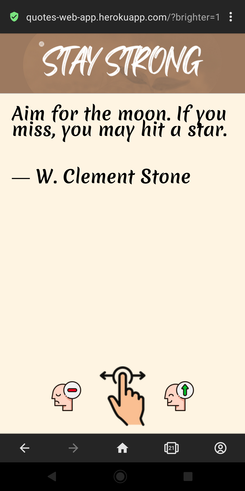
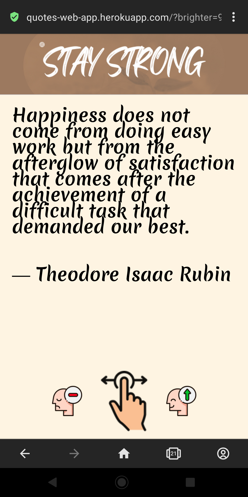
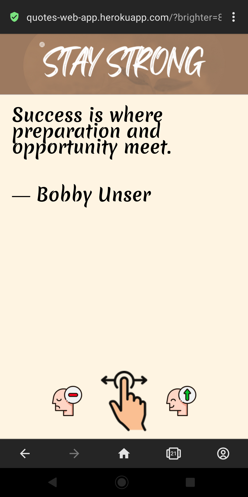
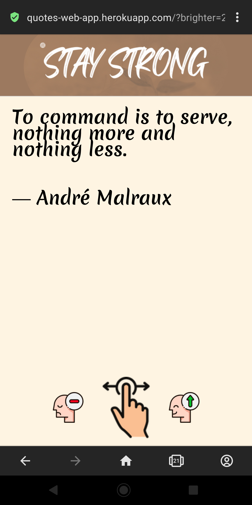

# NLP-Powered-Quote-Web-App
<p align="center">
  <a href="https://quotes-web-app-nlp-ml-powered-7d4f6b1a0e84.herokuapp.com/">
    
  </a>
  &nbsp
  &nbsp
  <a href="https://quotes-web-app-nlp-ml-powered-7d4f6b1a0e84.herokuapp.com/">
    
  </a>
  &nbsp
  &nbsp
  <a href="https://quotes-web-app-nlp-ml-powered-7d4f6b1a0e84.herokuapp.com/">
    
  </a>
</p>


# Project Overview


* Created a web app that provides quotes from the internet based on your mood
* It makes use of an API to scrape quotes from the internet
* The app has 110 quotes at any given time that it uses NLP to categorize
* Sorted the quotes using VaderSentiment SentimentIntensityAnalyzer, from most pleasant to most unfriendly
* Used requests to get the quotes from the API
* On a mobile device, you can swipe through the app!
* I made a web app using Flask. [Try it!!! It also works well on mobile.](https://quotes-web-app-nlp-ml-powered-7d4f6b1a0e84.herokuapp.com/)


## Code and Resources Used


**Python Version:** 3.10.5


**Packages:** pandas, NumPy, sklearn, matplotlib, seaborn, vaderSentiment, requests, nltk


**For Web Framework Requirements:**  ```pip install -r requirements.txt```


**API:**
https://github.com/lukePeavey/quotable


**Flask Productionization:**
https://quotes-web-app-nlp-ml-powered-7d4f6b1a0e84.herokuapp.com/


## Scraping the quotes


I used an API command to scrape exactly 110 quotes at a time that were no more than 262 words long:


*    Aim for the moon. You might hit a star if you miss. --Stone, Clement


*    We can do anything we want to if we stick to it long enough. --Helaine Keller


*    You know you're in love when you can't fall asleep because reality is finally better than your dreams. --Dr. Seuss


*    ...and many others


## Classifying the quotations and taking care of the display


Getting the quotes, transforming them, and displaying them on the web app:


*    Got quotes using requests


* Converted them to JSON before converting them to a data frame of quotes and authors


* Analyzed the quotes using the SentimentIntensityAnalyzer


* Arranged them according to their feelings


* Developed the logic to display quotes that are lighter or darker depending on the user's swipe


## Page design


* Envato Elements is where I got the bottom graphics (paid)


* Used the website Canva to create the banner


* Handled the HTML and CSS for the quotes


* Swiping was made possible through Javascript code


<p align="center">
   https://quotes-web-app-nlp-ml-powered-7d4f6b1a0e84.herokuapp.com/
</p>
<p align="center">
  <a href="https://quotes-web-app-nlp-ml-powered-7d4f6b1a0e84.herokuapp.com/">
    
  </a>
</p>


